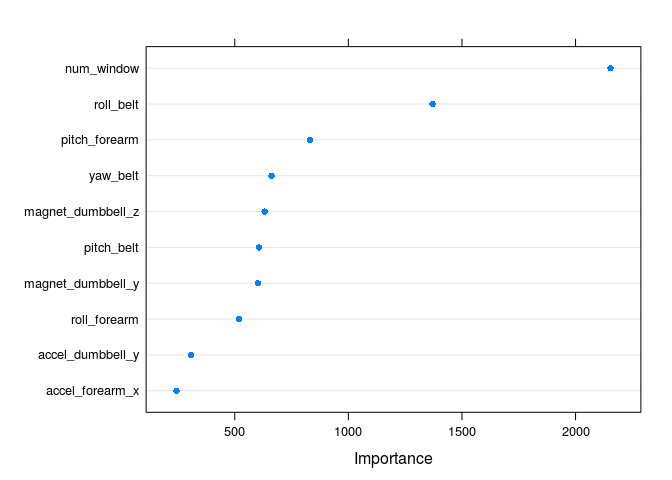

# Practical Machine Learning Course Project
Felipe J Colon-Gonzalez  
7 May 2016  

## Background

Using devices such as _Jawbone Up, Nike FuelBand_, and _Fitbit_ it is now possible to 
collect a large amount of data about personal activity relatively inexpensively. These 
type of devices are part of the quantified self movement (a group of enthusiasts who 
take measurements about themselves regularly to improve their health, to find patterns 
in their behavior, or because they are tech geeks). One thing that people regularly do 
is quantify how much of a particular activity they do, but they _**rarely quantify how 
well they do it**_. In this project, I aim to use data from accelerometers on the 
belt, forearm, arm, and dumbell of 6 participants. They were asked to perform barbell 
lifts correctly and incorrectly in 5 different ways. 

## Objectives
The main objective is to predict the manner in which a set of 20 individuals did their
exercise based on a predictive modelling using the `caret` package. The output variable 
is the _classe_ variable in the set. 

## Data
The training data for this project were kindly provided by: 

Ugulino, W.; Cardador, D.; Vega, K.; Velloso, E.; Milidiu, R.; Fuks, H. Wearable 
Computing: Accelerometers' Data Classification of Body Postures and Movements. 
Proceedings of 21st Brazilian Symposium on Artificial Intelligence. Advances in 
Artificial Intelligence - SBIA 2012. In: _Lecture Notes in Computer Science_. , pp. 
52-61. Curitiba, PR: Springer Berlin/Heidelberg, 2012. ISBN 978-3-642-34458-9. 
DOI: 10.1007/978-3-642-34459-6_6.

The training set is available in the following link:

https://d396qusza40orc.cloudfront.net/predmachlearn/pml-training.csv

The test set is available in this other link:

https://d396qusza40orc.cloudfront.net/predmachlearn/pml-testing.csv


```r
# ----------------------------
# Load packages and data
# ----------------------------

# Options
options(scipen=100, width=80)

# Load packages
require(caret)
require(randomForest)
require(data.table)
require(dplyr)

# Load data for analysis
training <- fread("https://d396qusza40orc.cloudfront.net/predmachlearn/pml-training.csv",
                  na.strings=c("NA", "", "#DIV/0!"))

testing  <- fread("https://d396qusza40orc.cloudfront.net/predmachlearn/pml-testing.csv",
                  na.strings=c("NA", "", "#DIV/0!"))
```

## Data Pre-processing

Variables with no meaningful relation with the outcome variable (e.g. V1, user name, and 
the different timestamp variables) were removed from the training set. Predictors with zero 
or near zero variance were also removed from the training set. It is noted that several
predictors have a large number of missing values (i.e. > 75%). Predictors missing 75% or 
more observations were removed from the trainig set too.


```r
# ----------------------------
# Data selection
# ----------------------------
# Remove near zero variance predictors
zero_variance <- nearZeroVar(training)
training_sub  <- training[,-zero_variance, with=FALSE]

# Remove non-senible variables
training_sub <- dplyr::select(training_sub, -matches("V1|timestamp|user_name"))

# Remove predictors with >=75% missing values
threshold    <- nrow(training_sub)*0.75 # Threshold for 75% of observations
drop_vars    <- training_sub[, colSums(is.na(training_sub)) > threshold] # identify vars
training_sub <- training_sub[, -drop_vars, with=FALSE] # remove from set
```

## Fitting Predictive Models Using Cross-Validation

For this project, I fit a model using the random forest routine. I selected the **_random 
forest_** routine aiming for the greatest accuracy possible. I use _**10-fold 
cross-validation**_ to obtain the model with the lowest test error. To test the accuracy, specificity and sensitivity of the model, I use partitioned the training subset into a
further training and testing sets comprising 75% and 25% of the observations respectively.
The relative importance of the top 10 predictors is shown in the figure below.


```r
# ----------------------------
# Model fit
# ----------------------------
# Create partition
set.seed(65432)
partition     <- createDataPartition(y=training_sub$classe, p=0.75, list=FALSE)

# Split set into training and test
training_sub2 <- training_sub[partition, ]
testing_sub2  <- training_sub[-partition, ]

# Fit predictive models
model <- train(classe ~., data=training_sub2, method="rf", 
               trControl=trainControl(method="cv", number=10), prox=TRUE, 
               allowParallel=TRUE)

# Plot the 10 most important variables in the model
dotPlot(varImp(model, scale=FALSE), top=10)
```

<!-- -->

## Calculating Out of Sample Predictions
The following step is to compute the out-of-sample predictions on the test subset to 
evaluate the model's performance.  


```r
# ----------------------------
# Out of sample predictions
# ----------------------------
# Compute predictions
predictions  <- predict(model, testing_sub2)

# Estimate out-of-sample error
pred_error  <- 1 - sum(predictions == testing_sub2$classe)/length(predictions)

# Generate confusion matrix
confusionMatrix(testing_sub2$classe, predictions)
```

```
## Confusion Matrix and Statistics
## 
##           Reference
## Prediction    A    B    C    D    E
##          A 1395    0    0    0    0
##          B    0  948    1    0    0
##          C    0    0  852    3    0
##          D    0    0    1  802    1
##          E    0    0    0    1  900
## 
## Overall Statistics
##                                                
##                Accuracy : 0.9986               
##                  95% CI : (0.9971, 0.9994)     
##     No Information Rate : 0.2845               
##     P-Value [Acc > NIR] : < 0.00000000000000022
##                                                
##                   Kappa : 0.9982               
##  Mcnemar's Test P-Value : NA                   
## 
## Statistics by Class:
## 
##                      Class: A Class: B Class: C Class: D Class: E
## Sensitivity            1.0000   1.0000   0.9977   0.9950   0.9989
## Specificity            1.0000   0.9997   0.9993   0.9995   0.9998
## Pos Pred Value         1.0000   0.9989   0.9965   0.9975   0.9989
## Neg Pred Value         1.0000   1.0000   0.9995   0.9990   0.9998
## Prevalence             0.2845   0.1933   0.1741   0.1644   0.1837
## Detection Rate         0.2845   0.1933   0.1737   0.1635   0.1835
## Detection Prevalence   0.2845   0.1935   0.1743   0.1639   0.1837
## Balanced Accuracy      1.0000   0.9999   0.9985   0.9973   0.9993
```

## Initial Results
The results on the out-of-sample set indicate that the model's accuracy is 99.90% 
(95% CI 99.76-99.97) - with an out-of-sample test error of 0.10%. Thus, I expect the
model to effectively predict correctly about 99.76%  or more of the observations in 
the testing set.

## Predictions On The Test Set
I finally used the fitted model to predict the manner in which 20 different individuals
did their exercise (i.e. the variable `classe`). The results are presented below and
will be used for answering _Quiz 4_.


```r
# ----------------------------
# Predictions using the testing
# set
# ----------------------------

# Predict using model and test set
predict_test <- predict(model, testing, type="raw")

# Print predictions
predict_test
```

```
##  [1] B A B A A E D B A A B C B A E E A B B B
## Levels: A B C D E
```

```r
# ----------------------------
# End of file
# ----------------------------
```


